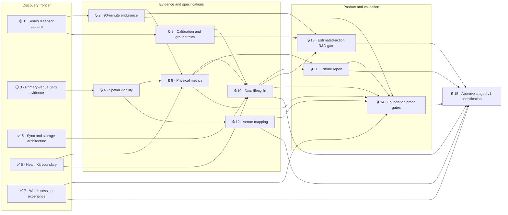

# Personal Apple Watch Football Performance System — Foundation + Conditional Detector Extension

Label: `wayfinder:map`

## Destination

Produce an implementation-ready specification for the v1 foundation: dependable 90-minute offline Apple Watch recording, Watch-to-iPhone syncing, venue-aware physical analysis, chart-first reports, privacy boundaries, and foundation-wide proof gates.

The map must also define a bounded conditional R&D extension for personalized Estimated Actions—probable passes, probable shots or powerful kicks, and dribble/carry bursts—without claiming that detection is feasible before real post-foundation data passes the agreed quality gate.

## Notes

- The confirmed product choices are recorded in [Batch-grilling decisions](decisions.md) and are fixed constraints, not open questions.
- The canonical domain language is [Football Performance](../../CONTEXT.md); [Glossary pointer](glossary.md) exists only for navigation.
- This is a personal development build for an Apple Watch Series 8 worn on the left wrist by a left-footed RB/LB playing mostly outdoor 6/7-a-side football.
- Normal use is offline and private: Watch records without iPhone connectivity, iPhone analyzes locally after sync, and no account, server, or cloud processing is permitted.
- Milestone order is fixed: dependable recorder, physical analytics, calibration and ground truth, then conditional Estimated Actions.
- Estimated Actions remain hidden until they achieve at least 80% precision across three unseen real sessions; recall is also measured.
- Poor evidence must preserve the Football Session while omitting or degrading dependent analysis honestly.
- Garmin Forerunner 35 data may be used only as comparison evidence during investigation.
- Use `domain-modeling` when terminology changes, primary-source `research` for platform facts, and `flowdeck` for future Apple build/run work. Charting this map authorizes none of that implementation work.

## Decisions so far

- ✅ [Watch-to-iPhone sync and storage architecture](issues/05-select-sync-storage-architecture.md):
  offline Watch-owned package and outbox, background file transfer, durable
  digest-matched import receipt, local iPhone file vault/index, exact-byte
  export, and tombstone-protected local deletion.
- ✅ [HealthKit ownership and deletion boundary](issues/06-define-healthkit-boundary.md):
  Watch-only HealthKit access, unavailable-not-zero read semantics, private-only
  ordinary deletion, and exact-ledger-only optional HealthKit mutation.
- ✅ [Watch Football-Session experience](issues/07-specify-watch-session-experience.md):
  eight-state machine (authorizing through failed), Start countdown and haptic,
  no auto-pause, protected Hold-to-Finish, background reopen, interruption
  sealing and package recovery, battery and sensor-quality warnings,
  original-recording preservation, and the immediate saved summary — specified
  with acceptance rules in specs/07.

## Live roadmap

Status: **3/15 resolved** · Ticket 1 claimed · Ticket 3 ready · 9 blocked.

Legend: 🟡 claimed · ⚪ ready · 🔒 blocked · ✅ resolved.

## Not yet specified

- Detector feature engineering, model family, and training approach after the foundation produces representative labelled motion data.
- The numeric values learned for personalized sprint and intensity thresholds after enough Valid Sessions exist.
- Heat-map fidelity and correction strategy at additional venues after the primary-venue survey establishes a repeatable evidence standard.
- Exact capture tickets for the second and third venues after the primary-venue synthesis names their priority and required evidence.
- Session-end trim suggestion heuristics after real forgotten-finish recordings reveal their shape.

## Out of scope

- App source code, Xcode project creation, implementation, deployment, or distribution during this map-charting session.
- TestFlight or App Store distribution, multiple users, generalized player models, accounts, servers, or cloud processing.
- Pass completion, shot outcome, exact touches, possession, tackles, interceptions, or any claim that requires observing the ball, teammates, or opponents.
- Readiness scores, injury-risk or medical advice, weather analysis, generic population norms, opaque performance scores, streaks, or weekly-goal gamification.
- Live coaching, halves, scoring, substitutions, match clocks, or auto-pause.
- Garmin product integration.
- Pre-foundation detector corpus capture or evaluation that requires the not-yet-existing recorder.
